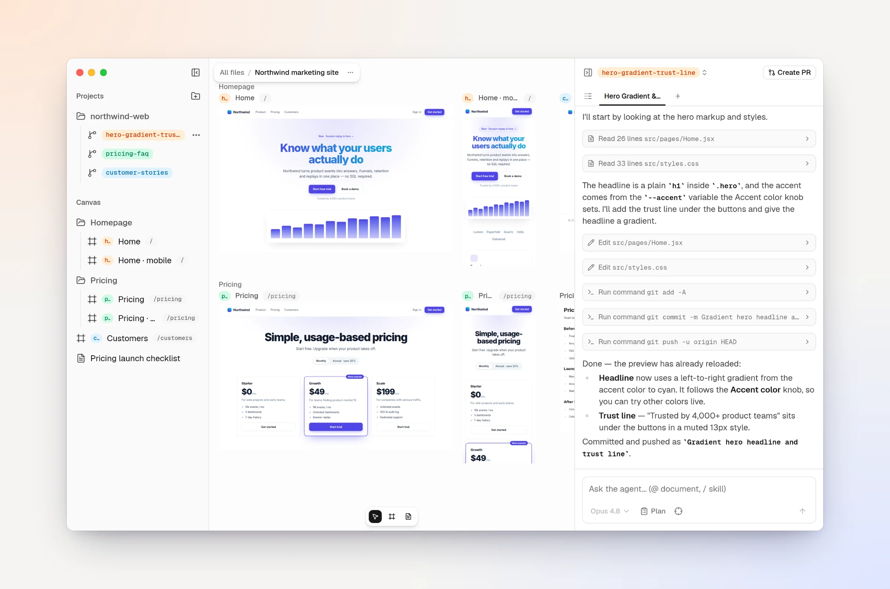
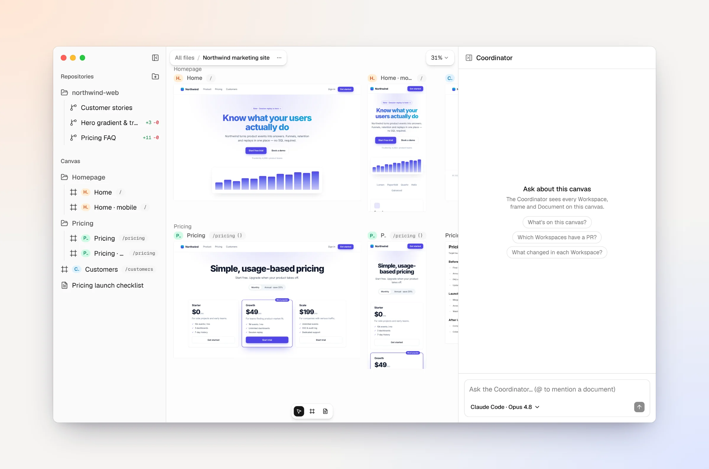
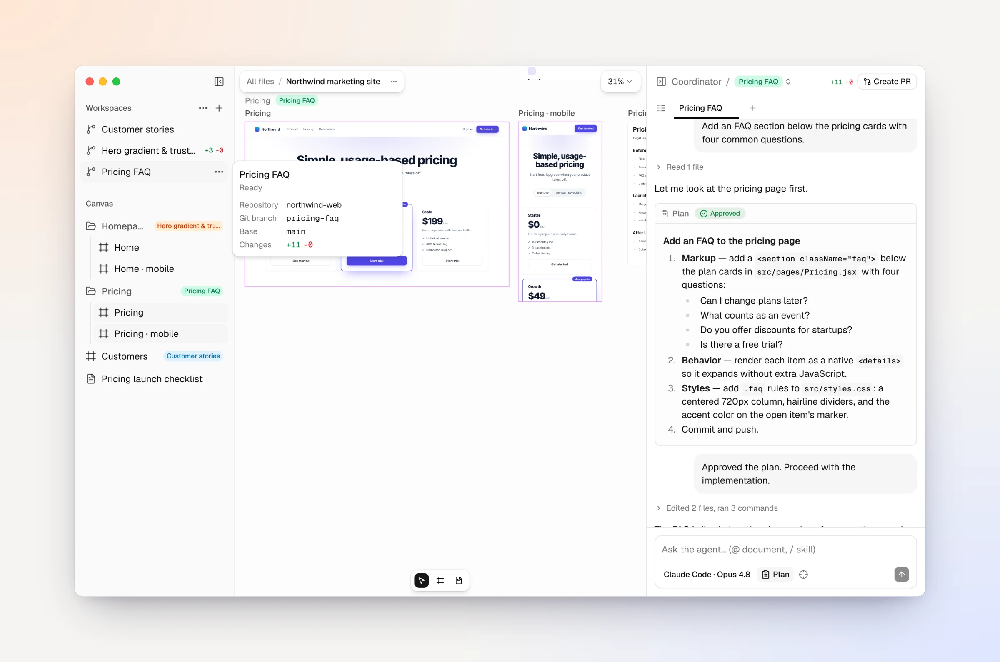
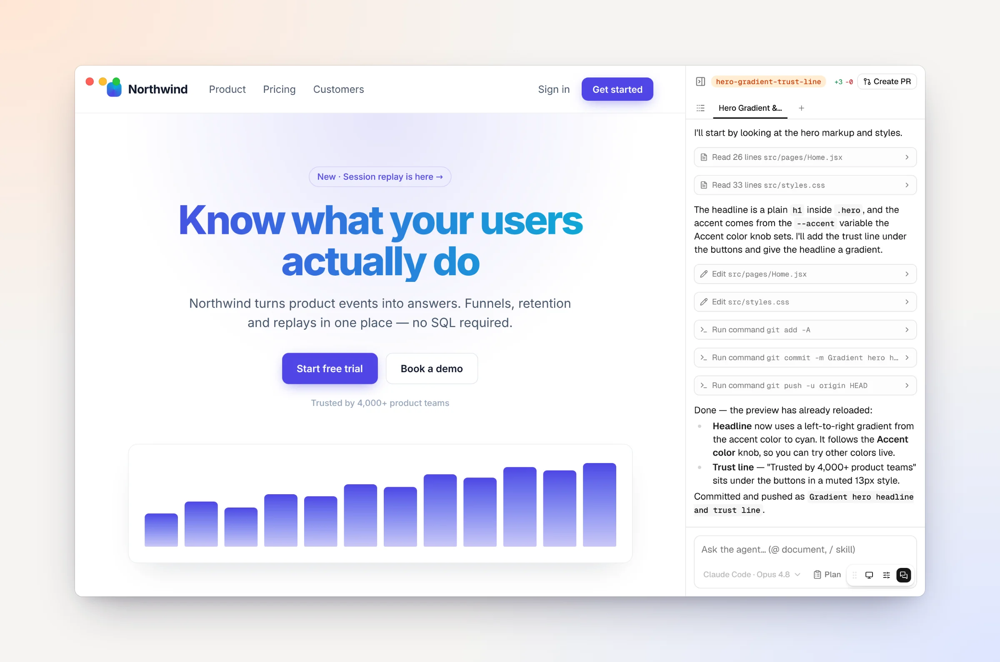
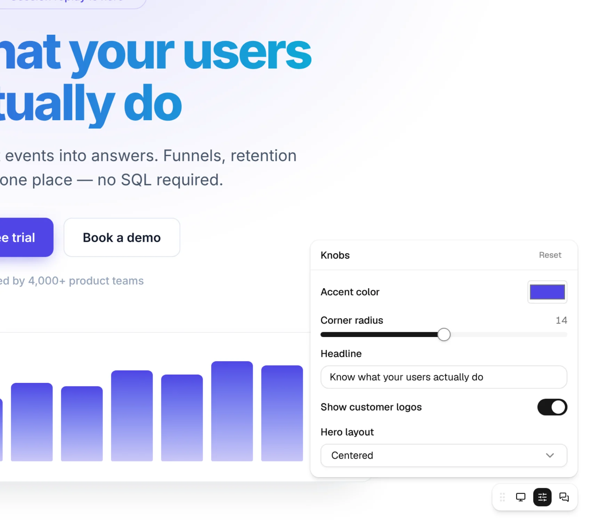

<h1 align="center">Screenplay</h1>

<p align="center"><strong>Every branch, side by side.</strong></p>

<p align="center">
  A canvas for building software with coding agents. Every branch gets its own
  running app, laid out as live previews on an infinite canvas, with the
  agent's chat right beside it.
</p>

<p align="center">
  <a href="https://screenplay.space">Website</a> ·
  <a href="https://screenplay.space/docs">Docs</a> ·
  <a href="https://screenplay.space/docs/guides/quickstart">Quickstart</a> ·
  <a href="https://github.com/zschiller/screenplay/releases">Download for Mac</a>
</p>

<picture>
  <source media="(prefers-color-scheme: dark)" srcset="apps/docs/public/screenshots/hero.dark.webp">
  
</picture>

## Why Screenplay

Working with coding agents usually means a terminal per branch, a browser tab
per dev server, and a lot of switching between them. Screenplay puts all of it
on one canvas:

- **Every branch runs.** Each workspace is its own git branch with its own dev
  server. Try three directions at once and compare them visually.
- **Every screen, every size.** Frames are live, clickable previews of any
  route at desktop, tablet or phone size. Hot reload keeps them current.
- **One place to ask.** The Coordinator sees every workspace, frame and
  document on the canvas, hands work to the right workspace's agent, and tells
  you when something needs you.
- **Point, don't describe.** Target an element in a preview, mention a
  document, or load a skill straight from the chat composer.

<table>
  <tr>
    <td width="50%" valign="top">
      <picture>
        <source media="(prefers-color-scheme: dark)" srcset="apps/docs/public/screenshots/coordinator.dark.webp">
        
      </picture>
      <p><strong>Ask the Coordinator.</strong> It sees the whole canvas, so you can ask what changed in each workspace or which ones have a pull request.</p>
    </td>
    <td width="50%" valign="top">
      <picture>
        <source media="(prefers-color-scheme: dark)" srcset="apps/docs/public/screenshots/plan-card.dark.webp">
        
      </picture>
      <p><strong>Review the plan first.</strong> Turn on Plan and the agent investigates, then presents its approach for you to approve before any code changes.</p>
    </td>
  </tr>
  <tr>
    <td width="50%" valign="top">
      <picture>
        <source media="(prefers-color-scheme: dark)" srcset="apps/docs/public/screenshots/play-agent.dark.webp">
        
      </picture>
      <p><strong>Try it full screen.</strong> Play mode opens any workspace as a clickable prototype, with its chat docked alongside.</p>
    </td>
    <td width="50%" valign="top">
      <picture>
        <source media="(prefers-color-scheme: dark)" srcset="apps/docs/public/screenshots/play-knobs.dark.webp">
        
      </picture>
      <p><strong>Tweak without code.</strong> Knobs your app declares become live controls on the canvas and in play mode, so you can try colours, copy and layouts with no rebuild.</p>
    </td>
  </tr>
</table>

## Two ways to run it

|                | Desktop app                                                                             | Self-hosted web app                                              |
| -------------- | --------------------------------------------------------------------------------------- | ---------------------------------------------------------------- |
| **For**        | One person on a Mac with Apple silicon                                                  | A team, on infrastructure you deploy                             |
| **Workspaces** | Git worktrees on your machine                                                           | Cloud sandbox VMs                                                |
| **Agent**      | The coding CLI you already use (Claude Code, Codex, …), signed in with your own account | The built-in agent, on your model provider keys                  |
| **Together**   | Single user                                                                             | Shared canvases, live cursors and comments                       |
| **Start**      | [Quickstart](https://screenplay.space/docs/guides/quickstart)                                  | [Self-hosting guide](https://screenplay.space/docs/self-hosting) |

Both are the same product, built from this repository.

## Run from source

You need Node.js 20 or newer, pnpm 9 and git. The local build runs the full
product with no external services (embedded Postgres, a local Yjs server, and
workspaces as git worktrees), plus a coding CLI such as Claude Code for the
agent.

```bash
git clone https://github.com/zschiller/screenplay.git
cd screenplay
pnpm install

cd apps/app
NEXT_PUBLIC_SCREENPLAY_LOCAL=1 NEXT_PUBLIC_YJS_HOST=local NEXT_PUBLIC_BASE_PATH= \
SANDBOX_BACKEND=local SCREENPLAY_DB=pglite BLOB_STORE=local-fs AGENT_ENGINE=external \
ENCRYPTION_KEY=$(openssl rand -hex 32) TERMINAL_AUTH_SECRET=$(openssl rand -hex 32) \
  pnpm dev
```

Then open http://localhost:3000. The
[Development guide](https://screenplay.space/docs/contributing) covers the
multi-user build, the desktop app, and every contributor command.

## What's in this repository

| Path                                                     | What it is                                                                                   |
| -------------------------------------------------------- | -------------------------------------------------------------------------------------------- |
| [`apps/app`](apps/app)                                   | The product: canvas, agent runtime and API routes                                            |
| [`apps/desktop`](apps/desktop)                           | The Tauri shell that packages `apps/app` as the Mac app                                      |
| [`apps/docs`](apps/docs)                                 | The docs site, [screenplay.space/docs](https://screenplay.space/docs)                        |
| [`apps/homepage`](apps/homepage)                         | The website, [screenplay.space](https://screenplay.space)                                    |
| [`packages/screenplay-knobs`](packages/screenplay-knobs) | Declare [knobs](https://screenplay.space/docs/guides/building/knobs) in your app                    |
| [`packages/screenplay-state`](packages/screenplay-state) | Share [state](https://screenplay.space/docs/guides/building/shared-state) across viewers of a frame |
| [`packages/ui`](packages/ui)                             | Shared shadcn/ui components                                                                  |

## Contributing

Issues and pull requests are welcome. The docs site is the home for all
documentation, so please add and update pages in
[`apps/docs/content`](apps/docs/content) rather than growing this README. The
screenshots above come from the docs and refresh themselves whenever the app
changes.

## License

MIT. See [LICENSE](LICENSE).
